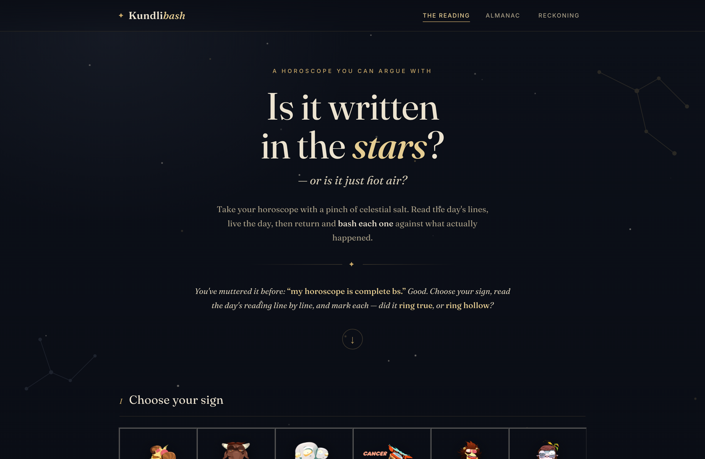
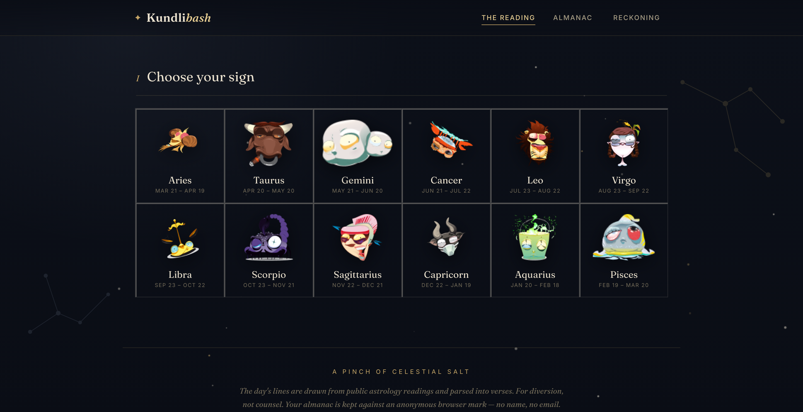
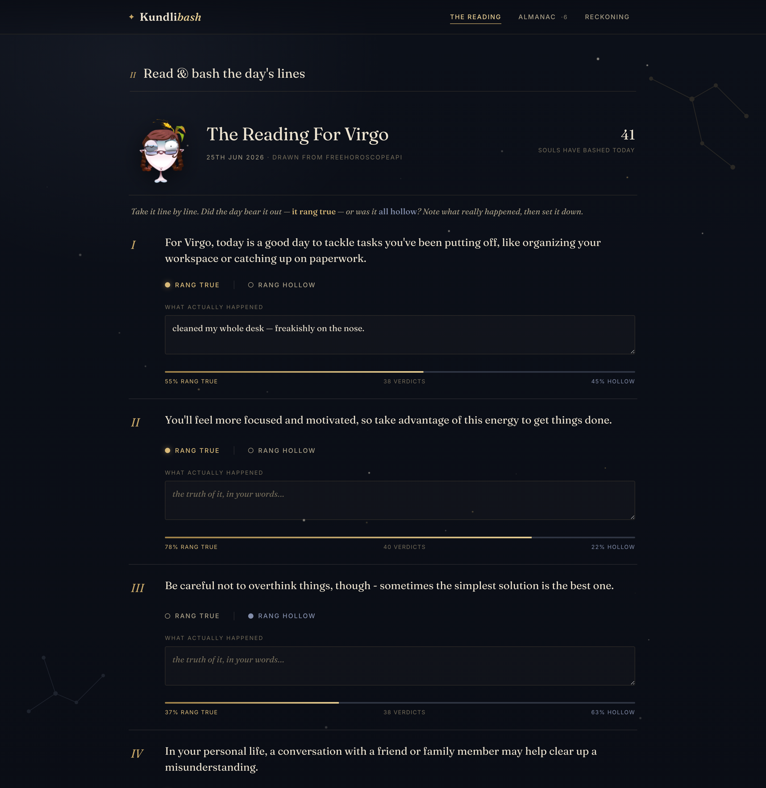
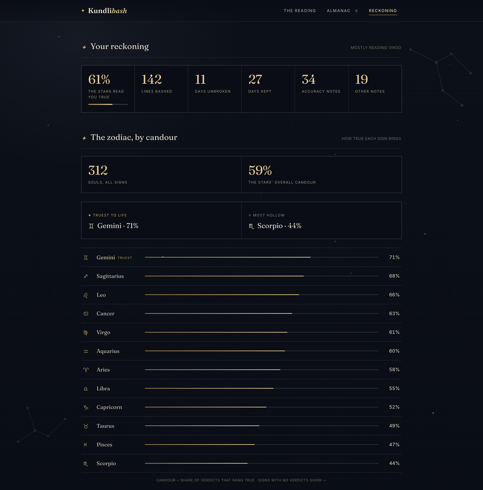

# Kundlibash

> A horoscope you're allowed to argue with. Read the day's reading, live the day, then **bash each line against what actually happened** — and watch the whole zodiac get graded on how true it rings.



Take your horoscope with a pinch of celestial salt. Built on Cloudflare Pages + Functions + KV. No framework, no build step, no login.

---

## What it does
1. **Predict** — pulls each sign's real daily horoscope and splits it into discrete, testable lines.
2. **Bash** — at day's end you mark each line **rang true** or **rang hollow**, and note what actually happened.
3. **Reckon** — verdicts roll up into your private record *and* a public scoreboard of which signs ring true and which are hot air.

Everything funnels into three ledgers: **accuracy notes**, **other notes**, and **stats** (personal + community).


*Pick your sign — the zodiac, illustrated.*

|  |  |
|---|---|
|  |  |
| *The Reading — bash each line true / hollow* | *The Reckoning — the zodiac ranked by candour* |

## Quick start
```bash
npm run dev          # wrangler pages dev → http://127.0.0.1:8788  (local KV, no setup)
```
Try the guided tour with sample data: `http://127.0.0.1:8788/?demo=1`

## Deploy (Cloudflare Pages)
```bash
npm run kv:create    # create the BASH_KV namespace → paste its id into wrangler.toml
npm run deploy       # → https://kundlibash.pages.dev
```
Full steps + ops in [docs/DEPLOY.md](docs/DEPLOY.md).

## Documentation
- [**Product overview**](docs/PRODUCT.md) — the concept, the audience, the roadmap
- [**Architecture**](docs/ARCHITECTURE.md) — stack, request flow, data model, trade-offs
- [**API reference**](docs/API.md) — the four endpoints, with examples
- [**Deploy & ops runbook**](docs/DEPLOY.md) — ship it, bind KV, custom domain, rollback
- [**User guide**](docs/USER_GUIDE.md) — how to bash, notes, stats, privacy, deep-links

## Stack at a glance
| | |
|---|---|
| Front end | one static `public/index.html` (vanilla JS SPA) |
| Back end | Cloudflare Pages Functions (`functions/`) |
| Storage | one KV namespace, `BASH_KV` |
| Identity | anonymous `byh_uid` cookie — no accounts |
| Predictions | `freehoroscopeapi.com` → `ohmanda.com` → built-in bank, cached per sign+day |

## Zodiac illustrations
The zodiac emblems on the live site are a commercial asset **licensed via Envato** and are **not included** in this repository. When the art is absent (as in a fresh clone), the app falls back to typographic zodiac glyphs. To use your own art, drop transparent PNGs at `public/assets/signs/<sign>.png` (e.g. `aries.png`, `virgo.png`).

> For diversion, not counsel. Built with Claude Code.
